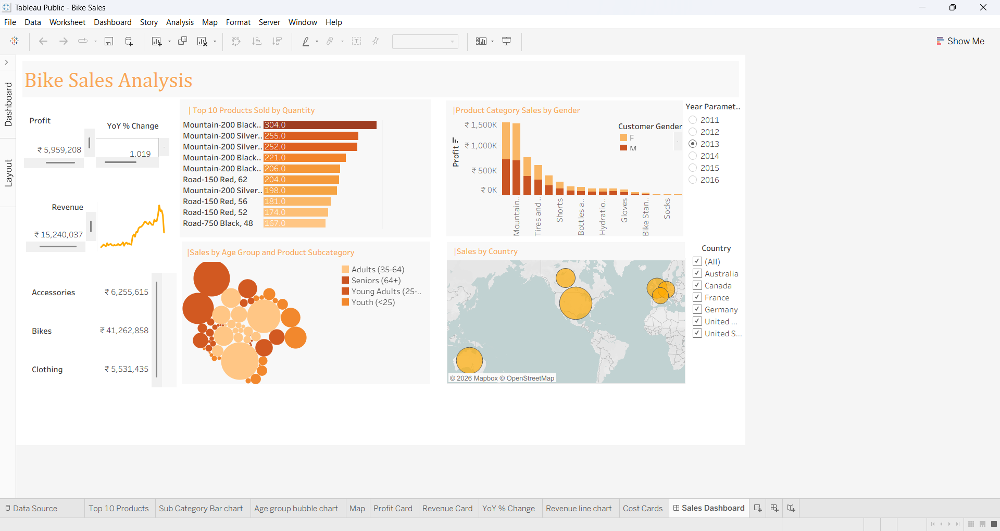

# 🚴 Bike Sales Analysis Dashboard

## 📊 Overview
This project presents an interactive Bike Sales Analysis Dashboard built using Tableau. It provides insights into sales performance, customer behavior, and product trends.

## ✨ Features
- Top 10 products based on order quantity
- Profit, Revenue, and Year-over-Year (YoY) analysis
- Customer segmentation by age and gender
- Country-wise sales analysis
- Interactive filters and parameters

## 🎛️ Interactivity
- Year selection using parameter (2011–2016)
- Country filter for region-based analysis
- Dynamic charts that update based on user input

## 🛠️ Tools Used
- Tableau Public
- Data Visualization
- Dashboard Design

## 📈 Insights
- Identified best-performing products
- Observed revenue and profit trends
- Compared performance across years
- Analyzed customer demographics

## 📸 Dashboard Preview

## 🔗 Tableau Link
(https://public.tableau.com/views/BikeSales_17755383922550/SalesDashboard?:language=en-US&:sid=&:redirect=auth&:display_count=n&:origin=viz_share_link)

## 📌 Conclusion
This dashboard helps in understanding business performance and supports data-driven decision-making through interactive visuals.
